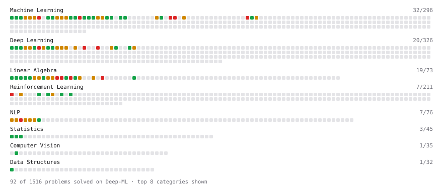

# Deep-ML

My machine learning practice from [Deep-ML](https://www.deep-ml.com). Every solution here was written by hand.

**108** solved · 106 problems · 2 labs · 0 math

[**Browse the interactive portfolio**](https://nibekasov.github.io/deep-ml/) to replay this filling in over time.

## Problems

| | Difficulty | Solved | |
| --- | --- | --- | --- |
| [Batch Iterator for Dataset](https://www.deep-ml.com/problems/30) | easy | 2024-08-09 | [solution](problems/0030-batch-iterator-for-dataset) |
| [Calculate 2x2 Matrix Inverse](https://www.deep-ml.com/problems/8) | easy | 2024-08-22 | [solution](problems/0008-calculate-2x2-matrix-inverse) |
| [Calculate Accuracy Score](https://www.deep-ml.com/problems/36) | easy | 2024-08-09 | [solution](problems/0036-calculate-accuracy-score) |
| [Calculate Covariance Matrix](https://www.deep-ml.com/problems/10) | easy | 2024-08-10 | [solution](problems/0010-calculate-covariance-matrix) |
| [Calculate Dice Score for Classification](https://www.deep-ml.com/problems/73) | easy | 2025-11-12 | [solution](problems/0073-calculate-dice-score-for-classification) |
| [Calculate Mean Absolute Error (MAE)](https://www.deep-ml.com/problems/93) | easy | 2025-11-11 | [solution](problems/0093-calculate-mean-absolute-error-mae) |
| [Calculate Mean by Row or Column](https://www.deep-ml.com/problems/4) | easy | 2024-08-09 | [solution](problems/0004-calculate-mean-by-row-or-column) |
| [Calculate R-squared for Regression Analysis](https://www.deep-ml.com/problems/69) | easy | 2025-11-09 | [solution](problems/0069-calculate-r-squared-for-regression-analysis) |
| [Calculate Root Mean Square Error (RMSE)](https://www.deep-ml.com/problems/71) | easy | 2025-11-11 | [solution](problems/0071-calculate-root-mean-square-error-rmse) |
| [Calculate the Discounted Return for a Given Trajectory](https://www.deep-ml.com/problems/167) | easy | 2025-11-08 | [solution](problems/0167-calculate-the-discounted-return-for-a-given-trajectory) |
| [Calculate the Phi Coefficient](https://www.deep-ml.com/problems/95) | easy | 2025-11-11 | [solution](problems/0095-calculate-the-phi-coefficient) |
| [Calculate Unigram Probability from Corpus](https://www.deep-ml.com/problems/129) | easy | 2025-05-25 | [solution](problems/0129-calculate-unigram-probability-from-corpus) |
| [Compute Discounted Return](https://www.deep-ml.com/problems/165) | easy | 2025-11-08 | [solution](problems/0165-compute-discounted-return) |
| [Convert Vector to Diagonal Matrix](https://www.deep-ml.com/problems/35) | easy | 2024-08-09 | [solution](problems/0035-convert-vector-to-diagonal-matrix) |
| [Descriptive Statistics Calculator](https://www.deep-ml.com/problems/78) | easy | 2025-02-05 | [solution](problems/0078-descriptive-statistics-calculator) |
| [Dot Product Calculator](https://www.deep-ml.com/problems/83) | easy | 2025-03-15 | [solution](problems/0083-dot-product-calculator) |
| [Feature Scaling Implementation](https://www.deep-ml.com/problems/16) | easy | 2024-08-08 | [solution](problems/0016-feature-scaling-implementation) |
| [Gradient Checkpointing](https://www.deep-ml.com/problems/188) | easy | 2025-11-08 | [solution](problems/0188-gradient-checkpointing) |
| [Grayscale Image Contrast Calculator](https://www.deep-ml.com/problems/82) | easy | 2025-02-17 | [solution](problems/0082-grayscale-image-contrast-calculator) |
| [Implement F-Score Calculation for Binary Classification](https://www.deep-ml.com/problems/61) | easy | 2025-11-11 | [solution](problems/0061-implement-f-score-calculation-for-binary-classification) |
| [Implement Precision Metric](https://www.deep-ml.com/problems/46) | easy | 2024-08-27 | [solution](problems/0046-implement-precision-metric) |
| [Implement Recall Metric in Binary Classification](https://www.deep-ml.com/problems/52) | easy | 2025-11-11 | [solution](problems/0052-implement-recall-metric-in-binary-classification) |
| [Implement ReLU Activation Function](https://www.deep-ml.com/problems/42) | easy | 2024-08-26 | [solution](problems/0042-implement-relu-activation-function) |
| [Implement Ridge Regression Loss Function](https://www.deep-ml.com/problems/43) | easy | 2024-08-26 | [solution](problems/0043-implement-ridge-regression-loss-function) |
| [Implement the SELU Activation Function](https://www.deep-ml.com/problems/103) | easy | 2025-02-17 | [solution](problems/0103-implement-the-selu-activation-function) |
| [Implement the Softplus Activation Function](https://www.deep-ml.com/problems/99) | easy | 2025-11-11 | [solution](problems/0099-implement-the-softplus-activation-function) |
| [Implement Weight Decay as L2 Regularization](https://www.deep-ml.com/problems/198) | easy | 2025-11-17 | [solution](problems/0198-implement-weight-decay-as-l2-regularization) |
| [Implementation of Log Softmax Function](https://www.deep-ml.com/problems/39) | easy | 2024-08-09 | [solution](problems/0039-implementation-of-log-softmax-function) |
| [Incremental Mean for Online Reward Estimation](https://www.deep-ml.com/problems/159) | easy | 2025-11-08 | [solution](problems/0159-incremental-mean-for-online-reward-estimation) |
| [Leaky ReLU Activation Function](https://www.deep-ml.com/problems/44) | easy | 2024-08-27 | [solution](problems/0044-leaky-relu-activation-function) |
| [Linear Kernel Function](https://www.deep-ml.com/problems/45) | easy | 2024-09-02 | [solution](problems/0045-linear-kernel-function) |
| [Linear Regression Using Gradient Descent](https://www.deep-ml.com/problems/15) | easy | 2024-08-07 | [solution](problems/0015-linear-regression-using-gradient-descent) |
| [Linear Regression Using Normal Equation](https://www.deep-ml.com/problems/14) | easy | 2024-08-07 | [solution](problems/0014-linear-regression-using-normal-equation) |
| [Matrix-Vector Dot Product](https://www.deep-ml.com/problems/1) | easy | 2024-08-07 | [solution](problems/0001-matrix-vector-dot-product) |
| [Min-Max Scaling of Feature Values](https://www.deep-ml.com/problems/112) | easy | 2025-11-05 | [solution](problems/0112-min-max-scaling-of-feature-values) |
| [One-Hot Encoding of Nominal Values](https://www.deep-ml.com/problems/34) | easy | 2024-08-09 | [solution](problems/0034-one-hot-encoding-of-nominal-values) |
| [Random Shuffle of Dataset](https://www.deep-ml.com/problems/29) | easy | 2024-08-09 | [solution](problems/0029-random-shuffle-of-dataset) |
| [Reshape Matrix](https://www.deep-ml.com/problems/3) | easy | 2024-08-08 | [solution](problems/0003-reshape-matrix) |
| [Scalar Multiplication of a Matrix](https://www.deep-ml.com/problems/5) | easy | 2024-08-09 | [solution](problems/0005-scalar-multiplication-of-a-matrix) |
| [Sigmoid Activation Function Understanding](https://www.deep-ml.com/problems/22) | easy | 2024-08-08 | [solution](problems/0022-sigmoid-activation-function-understanding) |
| [Single Neuron](https://www.deep-ml.com/problems/24) | easy | 2024-08-07 | [solution](problems/0024-single-neuron) |
| [Softmax Activation Function Implementation ](https://www.deep-ml.com/problems/23) | easy | 2024-08-07 | [solution](problems/0023-softmax-activation-function-implementation) |
| [Transformation Matrix from Basis B to C](https://www.deep-ml.com/problems/27) | easy | 2024-08-09 | [solution](problems/0027-transformation-matrix-from-basis-b-to-c) |
| [Transpose of a Matrix](https://www.deep-ml.com/problems/2) | easy | 2024-08-07 | [solution](problems/0002-transpose-of-a-matrix) |
| [Upper Confidence Bound (UCB) Action Selection](https://www.deep-ml.com/problems/162) | easy | 2025-11-08 | [solution](problems/0162-upper-confidence-bound-ucb-action-selection) |
| [BM25 Ranking ](https://www.deep-ml.com/problems/90) | medium | 2025-02-17 | [solution](problems/0090-bm25-ranking) |
| [Build a Simple ETL Pipeline (MLOps)](https://www.deep-ml.com/problems/187) | medium | 2025-11-05 | [solution](problems/0187-build-a-simple-etl-pipeline-mlops) |
| [Calculate Correlation Matrix](https://www.deep-ml.com/problems/37) | medium | 2024-09-02 | [solution](problems/0037-calculate-correlation-matrix) |
| [Calculate Eigenvalues of a Matrix](https://www.deep-ml.com/problems/6) | medium | 2024-08-15 | [solution](problems/0006-calculate-eigenvalues-of-a-matrix) |
| [Chi-square Probability Distribution](https://www.deep-ml.com/problems/176) | medium | 2025-11-17 | [solution](problems/0176-chi-square-probability-distribution) |
| [Compute Pointwise Mutual Information](https://www.deep-ml.com/problems/111) | medium | 2025-05-25 | [solution](problems/0111-compute-pointwise-mutual-information) |
| [Divide Dataset Based on Feature Threshold](https://www.deep-ml.com/problems/31) | medium | 2024-08-10 | [solution](problems/0031-divide-dataset-based-on-feature-threshold) |
| [Dropout Layer](https://www.deep-ml.com/problems/151) | medium | 2025-11-19 | [solution](problems/0151-dropout-layer) |
| [Evaluate Translation Quality with METEOR Score](https://www.deep-ml.com/problems/110) | medium | 2025-03-16 | [solution](problems/0110-evaluate-translation-quality-with-meteor-score) |
| [Gauss-Seidel Method for Solving Linear Systems](https://www.deep-ml.com/problems/57) | medium | 2025-11-09 | [solution](problems/0057-gauss-seidel-method-for-solving-linear-systems) |
| [Generate Random Subsets of a Dataset](https://www.deep-ml.com/problems/33) | medium | 2024-08-22 | [solution](problems/0033-generate-random-subsets-of-a-dataset) |
| [Generate Sorted Polynomial Features](https://www.deep-ml.com/problems/32) | medium | 2024-08-21 | [solution](problems/0032-generate-sorted-polynomial-features) |
| [Gradient Bandit Action Selection](https://www.deep-ml.com/problems/163) | medium | 2025-11-08 | [solution](problems/0163-gradient-bandit-action-selection) |
| [Gradient Clipping by Global Norm](https://www.deep-ml.com/problems/197) | medium | 2025-11-17 | [solution](problems/0197-gradient-clipping-by-global-norm) |
| [Implement Adam Optimization Algorithm](https://www.deep-ml.com/problems/49) | medium | 2025-11-09 | [solution](problems/0049-implement-adam-optimization-algorithm) |
| [Implement AdamW Optimizer Step](https://www.deep-ml.com/problems/169) | medium | 2025-11-05 | [solution](problems/0169-implement-adamw-optimizer-step) |
| [Implement Gradient Descent Variants with MSE Loss](https://www.deep-ml.com/problems/47) | medium | 2024-09-02 | [solution](problems/0047-implement-gradient-descent-variants-with-mse-loss) |
| [Implement K-Fold Cross-Validation](https://www.deep-ml.com/problems/18) | medium | 2024-08-15 | [solution](problems/0018-implement-k-fold-cross-validation) |
| [Implement Lasso Regression using ISTA](https://www.deep-ml.com/problems/50) | medium | 2025-03-03 | [solution](problems/0050-implement-lasso-regression-using-ista) |
| [Implement Layer Normalization for Sequence Data](https://www.deep-ml.com/problems/109) | medium | 2025-03-16 | [solution](problems/0109-implement-layer-normalization-for-sequence-data) |
| [Implement Long Short-Term Memory (LSTM) Network](https://www.deep-ml.com/problems/59) | medium | 2025-11-11 | [solution](problems/0059-implement-long-short-term-memory-lstm-network) |
| [Implement Masked Self-Attention](https://www.deep-ml.com/problems/107) | medium | 2025-03-01 | [solution](problems/0107-implement-masked-self-attention) |
| [Implement PReLU Forward and Backward Pass](https://www.deep-ml.com/problems/98) | medium | 2025-11-11 | [solution](problems/0098-implement-prelu-forward-and-backward-pass) |
| [Implement Q-Learning Algorithm for MDPs](https://www.deep-ml.com/problems/133) | medium | 2025-11-08 | [solution](problems/0133-implement-q-learning-algorithm-for-mdps) |
| [Implement RMSProp Optimizer](https://www.deep-ml.com/problems/200) | medium | 2025-11-19 | [solution](problems/0200-implement-rmsprop-optimizer) |
| [Implement Self-Attention Mechanism](https://www.deep-ml.com/problems/53) | medium | 2025-03-01 | [solution](problems/0053-implement-self-attention-mechanism) |
| [Implement TF-IDF (Term Frequency-Inverse Document Frequency)](https://www.deep-ml.com/problems/60) | medium | 2025-03-03 | [solution](problems/0060-implement-tf-idf-term-frequency-inverse-document-frequency) |
| [Implement the Huber Loss Function](https://www.deep-ml.com/problems/192) | medium | 2025-11-09 | [solution](problems/0192-implement-the-huber-loss-function) |
| [Implementing a Simple RNN](https://www.deep-ml.com/problems/54) | medium | 2025-03-15 | [solution](problems/0054-implementing-a-simple-rnn) |
| [Implementing Basic Autograd Operations](https://www.deep-ml.com/problems/26) | medium | 2024-08-19 | [solution](problems/0026-implementing-basic-autograd-operations) |
| [Jensen-Shannon Divergence](https://www.deep-ml.com/problems/203) | medium | 2025-11-17 | [solution](problems/0203-jensen-shannon-divergence) |
| [K-Means Clustering](https://www.deep-ml.com/problems/17) | medium | 2024-08-15 | [solution](problems/0017-k-means-clustering) |
| [Linear Regression - Power Grid Optimization](https://www.deep-ml.com/problems/92) | medium | 2025-11-09 | [solution](problems/0092-linear-regression-power-grid-optimization) |
| [Matrix times Matrix ](https://www.deep-ml.com/problems/9) | medium | 2024-08-27 | [solution](problems/0009-matrix-times-matrix) |
| [Matrix Transformation ](https://www.deep-ml.com/problems/7) | medium | 2024-08-19 | [solution](problems/0007-matrix-transformation) |
| [Minimax Algorithm for Tic-Tac-Toe](https://www.deep-ml.com/problems/171) | medium | 2025-11-17 | [solution](problems/0171-minimax-algorithm-for-tic-tac-toe) |
| [Mutual Information](https://www.deep-ml.com/problems/204) | medium | 2025-11-17 | [solution](problems/0204-mutual-information) |
| [Optimal String Alignment Distance](https://www.deep-ml.com/problems/51) | medium | 2025-03-03 | [solution](problems/0051-optimal-string-alignment-distance) |
| [Principal Component Analysis (PCA) Implementation](https://www.deep-ml.com/problems/19) | medium | 2024-08-19 | [solution](problems/0019-principal-component-analysis-pca-implementation) |
| [Simple Convolutional 2D Layer](https://www.deep-ml.com/problems/41) | medium | 2024-08-22 | [solution](problems/0041-simple-convolutional-2d-layer) |
| [Single Neuron with Backpropagation](https://www.deep-ml.com/problems/25) | medium | 2024-08-15 | [solution](problems/0025-single-neuron-with-backpropagation) |
| [Solve Linear Equations using Jacobi Method](https://www.deep-ml.com/problems/11) | medium | 2024-08-10 | [solution](problems/0011-solve-linear-equations-using-jacobi-method) |
| [Warmup + Cosine Decay Schedule](https://www.deep-ml.com/problems/196) | medium | 2025-11-17 | [solution](problems/0196-warmup-cosine-decay-schedule) |
| [Decision Tree Learning](https://www.deep-ml.com/problems/20) | hard | 2024-08-25 | [solution](problems/0020-decision-tree-learning) |
| [Determinant of a 4x4 Matrix using Laplace's Expansion (hard)](https://www.deep-ml.com/problems/13) | hard | 2024-08-26 | [solution](problems/0013-determinant-of-a-4x4-matrix-using-laplace-s-expansion-hard) |
| [Gambler's Problem: Value Iteration](https://www.deep-ml.com/problems/164) | hard | 2025-11-12 | [solution](problems/0164-gambler-s-problem-value-iteration) |
| [Gaussian Process for Regression](https://www.deep-ml.com/problems/186) | hard | 2025-11-08 | [solution](problems/0186-gaussian-process-for-regression) |
| [GPT-2 Text Generation](https://www.deep-ml.com/problems/88) | hard | 2025-03-03 | [solution](problems/0088-gpt-2-text-generation) |
| [Implement a Simple RNN with Backpropagation Through Time (BPTT)](https://www.deep-ml.com/problems/62) | hard | 2025-11-12 | [solution](problems/0062-implement-a-simple-rnn-with-backpropagation-through-time-bptt) |
| [Implement AdaBoost Fit Method](https://www.deep-ml.com/problems/38) | hard | 2024-08-09 | [solution](problems/0038-implement-adaboost-fit-method) |
| [Implement Multi-Head Attention](https://www.deep-ml.com/problems/94) | hard | 2025-02-06 | [solution](problems/0094-implement-multi-head-attention) |
| [Implement the Conjugate Gradient Method for Solving Linear Systems](https://www.deep-ml.com/problems/63) | hard | 2025-03-16 | [solution](problems/0063-implement-the-conjugate-gradient-method-for-solving-linear-systems) |
| [Implement the GRPO Objective Function](https://www.deep-ml.com/problems/101) | hard | 2025-02-17 | [solution](problems/0101-implement-the-grpo-objective-function) |
| [Implementing a Custom Dense Layer in Python](https://www.deep-ml.com/problems/40) | hard | 2024-08-25 | [solution](problems/0040-implementing-a-custom-dense-layer-in-python) |
| [PCA Color Augmentation](https://www.deep-ml.com/problems/191) | hard | 2025-11-12 | [solution](problems/0191-pca-color-augmentation) |
| [Positional Encoding Calculator](https://www.deep-ml.com/problems/85) | hard | 2025-03-01 | [solution](problems/0085-positional-encoding-calculator) |
| [QR Decomposition](https://www.deep-ml.com/problems/201) | hard | 2025-11-19 | [solution](problems/0201-qr-decomposition) |
| [Singular Value Decomposition (SVD) of 2x2 Matrix](https://www.deep-ml.com/problems/12) | hard | 2024-08-25 | [solution](problems/0012-singular-value-decomposition-svd-of-2x2-matrix) |
| [SVD of a 2x2 Matrix](https://www.deep-ml.com/problems/28) | hard | 2024-08-27 | [solution](problems/0028-svd-of-a-2x2-matrix) |
| [Train Logistic Regression with Gradient Descent](https://www.deep-ml.com/problems/106) | hard | 2025-03-16 | [solution](problems/0106-train-logistic-regression-with-gradient-descent) |
| [Train Softmax Regression with Gradient Descent](https://www.deep-ml.com/problems/105) | hard | 2025-03-03 | [solution](problems/0105-train-softmax-regression-with-gradient-descent) |

## Labs

| | Difficulty | Solved | |
| --- | --- | --- | --- |
| [MNIST: Design Your Own Pytorch Optimizer](https://www.deep-ml.com/labs/3) | medium | 2025-11-19 | [solution](labs/0003-mnist-design-your-own-pytorch-optimizer) |
| [MNIST: Classification Loss (with Gradient)](https://www.deep-ml.com/labs/4) | hard | 2025-11-19 | [solution](labs/0004-mnist-classification-loss-with-gradient) |

---

_This file is regenerated by Deep-ML on every push._
